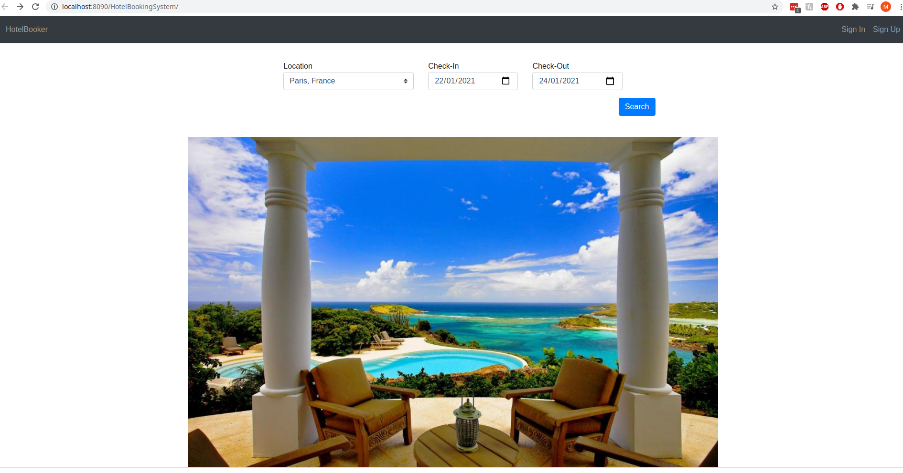
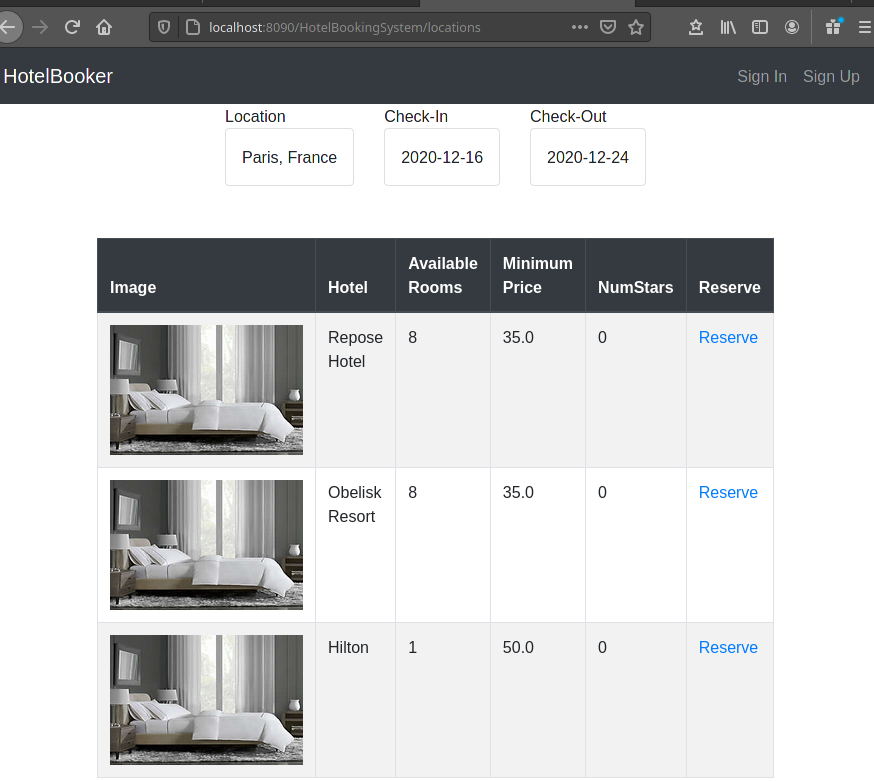
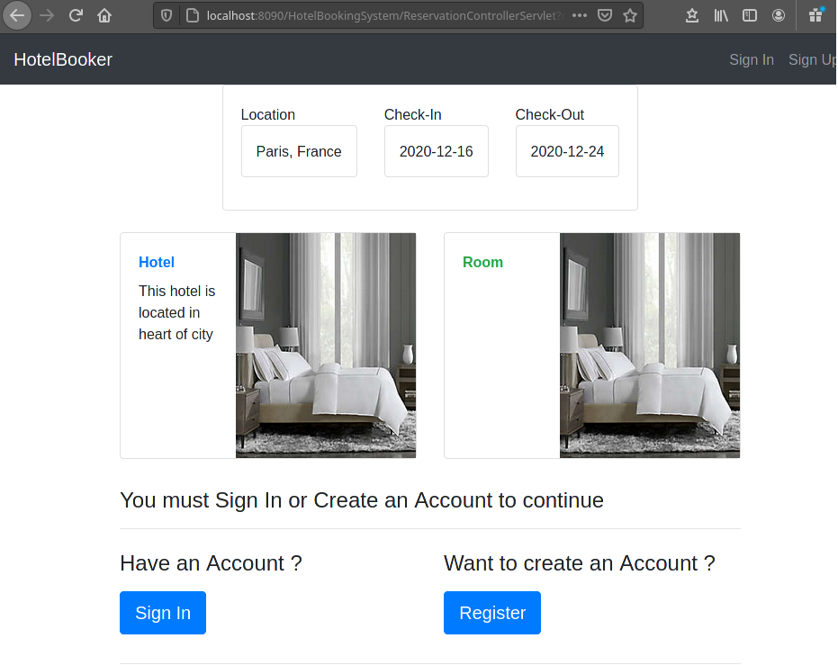
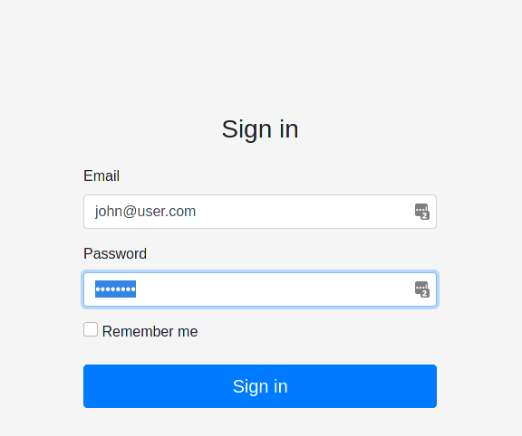
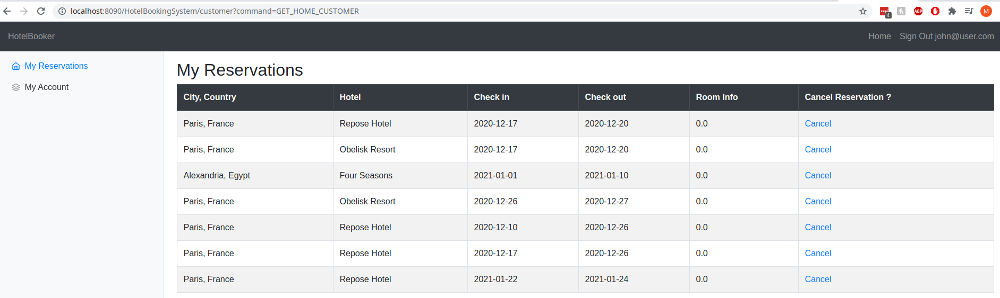
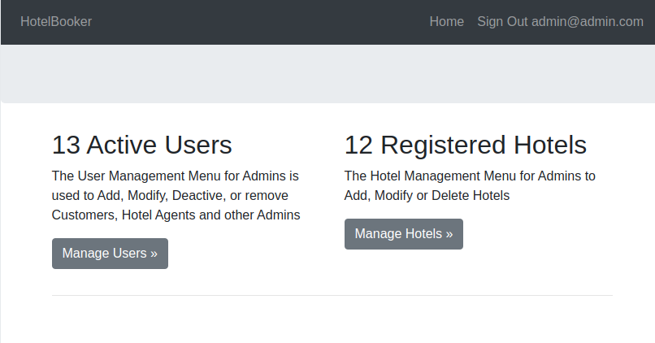
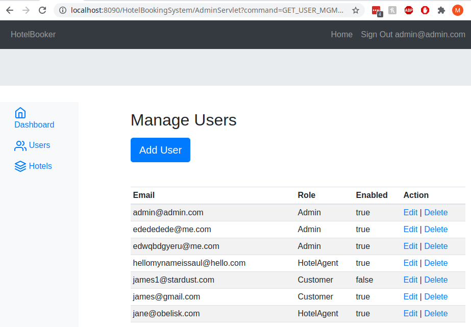

# Hotel Booking System

### TL;DR
This is a Hotel booking application, implementing features of a an app such as Expedia or HoteelBooking.com
The app supports Role Based Access (RBAC). The functionalities of the app is described in next section in terms of "which type of user can do what"

### Roles
1- Anonymous (non-authenticated user): Can browse Hotels for a chosen location, see pricing per room and availablitiles  (but not make one - requires authentication, sign in or sign up). 
2- Customer : can make/view/edit/cancel reservations. 
3- Hotel Employee : Can view/cancel all reservations for the Hotel they are employed in 
4 - Administrator : User + user role management, add/remove hotels. 

### Stack
- Servlet, JSP (MVC), JDBC
- Postgresql DB
- (+ Servlet Security : Authentication and authorization)

### Basic System Diagram

### Screenshots

### ER model

#### Home Page

#### Choose a Location, get list of hotels for that location

#### Reserve : First login or sign in before completing reservation
Customer can sign in, or if they don't have an account, sign up.
It's a necessary step to proceed with reservation

#### Reserve : Sign In (or Sign Up)
Customer can sign in, or if they don't have an account, sign up.
It's a necessary step to proceed with reservation

#### Customer Home Page
Customer home page accessible only for users with Role=App user 
as defined in the servlet-security section of pom.xml

#### Hotel Employee Home Page
Hotel Employee home page accessible only for users with Role=Hotel Manager,
as defined in the servlet-security section of pom.xml

The Hotel Employee for Hotel X can see all reservations, made by any user, for this hotel.

#### Admin
Admin Home Page : Admin can add / edit / delete application users with a role chosen by admin.
Admin can also add / edit / delete hotels that are listed in the booking app
accessible only for users with Role=Golab Admin,
as defined in the servlet-security section of pom.xml

#### Admin "User Management" Home page
Add/ edit / delete user

